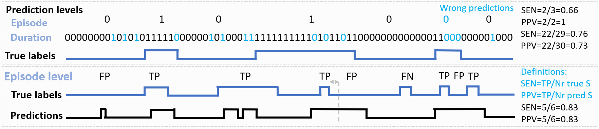

# Library for measuring performance of time series classification

## Motivation

For temporal and sequential data (e.g. in biomedical applications), standard performance evaluation metrics, such as sensitivity and specificity, may not always be the most appropriate and can even be misleading. Evaluation metrics must ultimately reflect the needs of users and also be sufficiently sensitive to guide algorithm development.

For example, for epilepsy monitoring, neurologists ask for assesments on the level of seizure episodes (events), rather than duration or sample-by-sample based metrics. Similarly,  another performance measure with a strong practical impact in epilepsy monitoring, is the false alarm rate (FAR), or the number of false positives per hour/day. Clinicians and patients see this measure as more meaningful than some established metrics in the ML community, and are very demanding in terms of performance, requiring it to be as low as possible for potential wearable applications (e.g., less than 1 FP/day). This also necessitates exceptionally high constraints on the required precision (usually much higher than 99\%).

For this reason, here we provide code that measures performance on the level of events and on a sample-by-sample basis.

## Metrics

In more details, we measures performance on the level of:

- Windows (or sample-by-sample) : Performance metric that threats every label sample independently.
- Events (e.g. epileptic seizure) : Classifies each event in both reference and hypothesis based on overlap of both.

In picture below are illustrate several use cases, how errors are counted, and what is the final performance measure.



## Code

An example usage of the library is provided in `example.ipynb`.

The library provides three classes :

- `annotation.Annotation` : store annotations
- `scoring.WindowScoring(ref, hyp)` : Compute window based scoring
- `scoring.EventScoring(ref, hyp)` : Compute event based scoring

### Parameters

Event based scoring allows to define certain parameters which are provided as an instance of `scoring.EventScoring.Parameters` :

- `toleranceStart` (float): Allow some tolerance on the start of an event without counting a false detection. Defaults to 1  # [seconds].
- `toleranceEnd` (float): Allow some tolerance on the end of an event without counting a false detection. Defaults to 10  # [seconds].
- `minOverlap` (float): Minimum relative overlap between ref and hyp for a detection. Defaults to 0.66  # [relative].
- `maxEventDuration` (float): Automatically split events longer than a given duration. Defaults to 5*60  # [seconds].

### Scores

Scores are provided as attributes of the scoring class. The following metrics can be accesses :

- `sensitivity`
- `precision`
- `f1` : F1-score
- `fpRate` : False alarm rate per 24h

## Example of usage

```python
## Loading Annotations ##

from annotations import Annotation

# Annotation objects can be instantiated from a binary mask

fs = 1
mask = [0,1,1,0,0,0,1,1,1,0]

labels = Annotation(mask, fs)

print('Annotation objects contain a representation as a mask and as a list of events:')
print(labels.mask)
print(labels.events)


# Annotation object can also be instantiated from a list of events
fs = 1
numSamples = 10  # In this case the duration of the recording in samples should be provided
events = [(1, 3), (6, 9)]

labels = Annotation(events, fs, numSamples)


## Computing performance score ## 

import scoring

fs = 10
ref = Annotation([1,1,1,0,0,0,1,1,1,0], fs)
hyp = Annotation([0,1,1,0,1,1,0,0,1,0], fs)
scores = scoring.WindowScoring(ref, hyp)

# Scores can also be computed per event
param = scoring.EventScoring.Parameters(
    toleranceStart=0,
    toleranceEnd=0,
    minOverlap=0.66,
    maxEventDuration=5*60)
scores = scoring.EventScoring(ref, hyp, param)

print("# Event scoring\n" +
      "- Sensitivity : {:.2f} \n".format(scores.sensitivity) + 
      "- Precision   : {:.2f} \n".format(scores.precision) + 
      "- F1-score    : {:.2f} \n".format(scores.f1) + 
      "- FP/24h      : {:.2f} \n".format(scores.fpRate))
```
